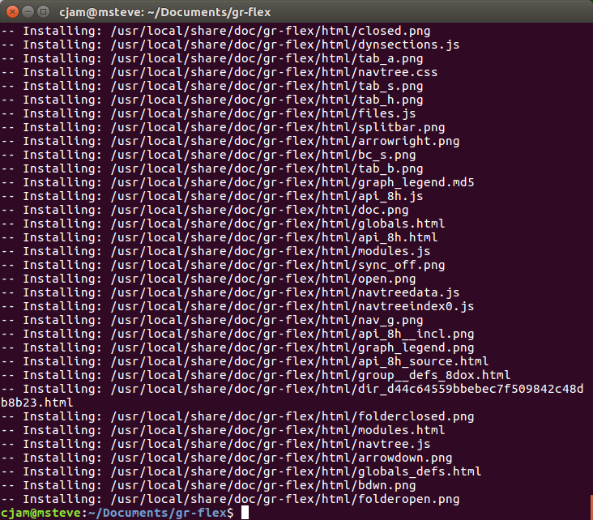
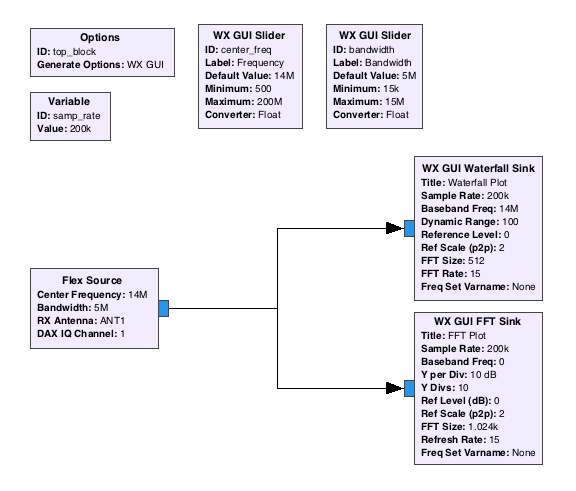
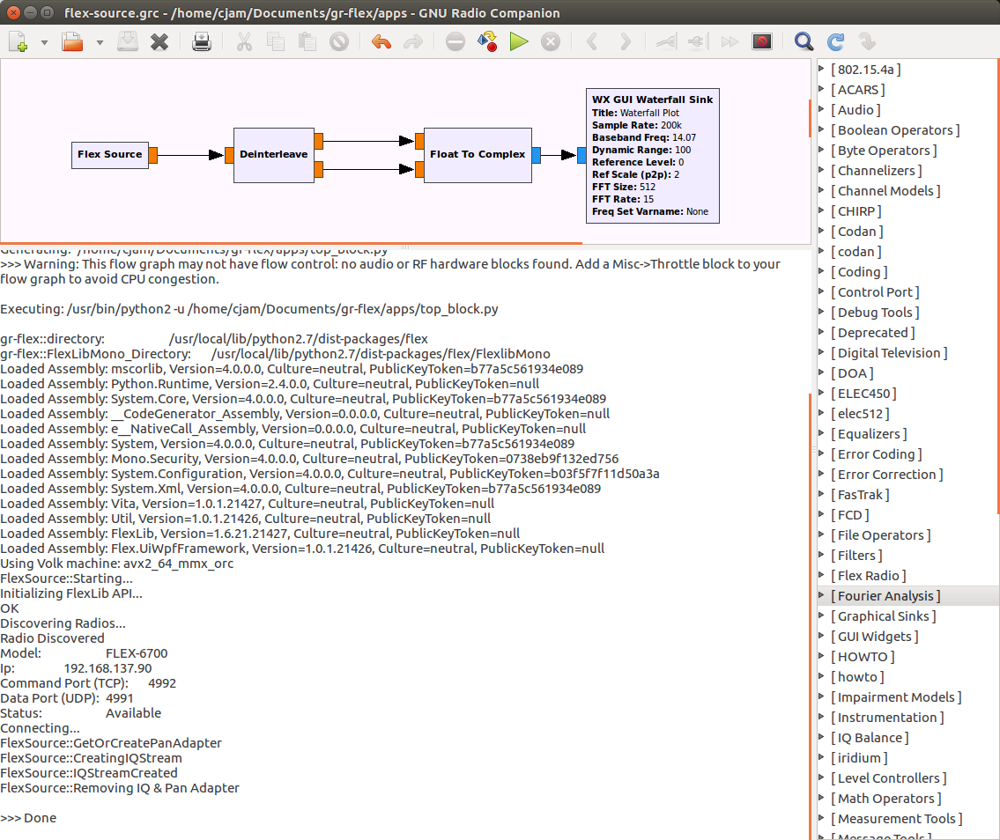

# GNU Radio Flex Blocks (gr-flex)

An Out of tree GNU Radio block for communicating with the Flex radio

### Architecture


## Getting Started

These instructions will get you a copy of the project up and running on your local machine for development and testing purposes. See deployment for notes on how to deploy the project on a live system.

This project uses a .Net library called FlexlibMono which I have forked and included as a submodule within this project.  You will need to run

`git submodule update --init`

### References

[GNU Radio OOT Blocks](https://wiki.gnuradio.org/index.php/OutOfTreeModules)

### Prerequisites

You will need the following pre-requisites installed on your machine (in this order):

- [GNU Radio](https://wiki.gnuradio.org/index.php/InstallingGR)
- **Python** (***Is required by GNU Radio***, tested with 2.7)


> **Linux / OSX** 
> - [Mono](http://www.mono-project.com/download/)

- [pip](https://pip.pypa.io/en/stable/installing/)
- [PythonNet]

```
> sudo pip install pythonnet
```

### Installing the block

Once all of the pre-requisites are installed, you can run the build script within the root of the project.

```
> cd <repo_director>
> sudo ./build.sh
```
This script will do the following:

- Build the Flexlib Mono project with MSBuild (Release Configuration)
- Copy the resulting binaries into the gr-flex module
- create a `build/` directory
- runs `CMake`  (Configures make files)
- runs `make`   (Builds python module)
- runs `sudo make install`  (Installs block into gnu-radio directory)

Here's some sample output from the script (installing into the gnu radio folders):


Here's how the **Flex Source** block currently looks in GNU Radio:



## Sample Apps
See the sample **GRC** files that have been placed into the `apps/` directory of this repo:

> `./apps/flex-source.grc`

## Running the Samples

Running the sample GRC files will show output from the gr-flex block that could potentially help with troubleshooting problems.

The Flex Radio has a discovery mechanism that works on the local area network to allow for applications to discover and configure themselves to interact with the Flex Radio.  

When the Flex Source starts up, it will go through the discovery process and output the results within the terminal.



## Running the tests

Unfortunately since the block requires the prescence of a Flex Radio, it makes mocking the block much harder to do.  To test this module, the sample apps were used to test and confirm functionality.

## Built With

* [CMAKE](https://cmake.org/) - CMake
* [MSBuild](http://www.mono-project.com/docs/tools+libraries/tools/xbuild/) - MSBuild (Mono)
* [PythonNet]
* [GNU Radio]

## Contributing

Pull Requests are welcome.

## Versioning

We use [SemVer](http://semver.org/) for versioning. For the versions available, see the [tags on this repository](https://github.com/your/project/tags). 

## Authors

* **Colter Mcquay** - *Initial work* 

See also the list of [contributors](https://github.com/your/project/contributors) who participated in this project.

## License

This project is licensed under the MIT License - see the [LICENSE.md](LICENSE.md) file for details

## Acknowledgments

Thanks to the following students who wrote some reports that provided some insight / approaches to solving this problem.

- Robert Cormier
- Marian Böhm
- Donatus Unuigboje 

Thanks to [Frank Werner-Krippendorf](https://github.com/krippendorf) for the work on the [FlexlibMono](https://github.com/krippendorf/FlexlibMono) project which I forked and used as a submodule within this repository.

[GNU Radio]: https://wiki.gnuradio.org/index.php/InstallingGR "GNU Radio"
[PythonNet]: https://pythonnet.github.io/ "Python.Net"
[Mono]: http://www.mono-project.com/download/ "Mono"
